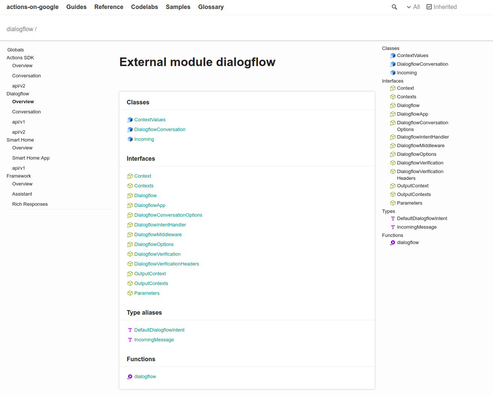

# Neo theme for TypeDoc

[](https://www.npmjs.com/package/typedoc-neo-theme)

This plugin contains a new theme for TypeDoc which focuses on improved readability and navigation.

Additionally, it extends Typedoc with additional options for a richer user experience.



Visit the [Actions on Google Node.js reference](https://actions-on-google.github.io/actions-on-google-nodejs)
to view this theme.

Visit http://typedoc.org/ to learn more about TypeDoc.

## Theme

Build the theme by running `yarn build:theme`.

After you install the module, you can use this theme in a build by running:

`typedoc --theme ./node_modules/typedoc-neo-theme/bin/default`

## Plugin

Build the plugin by running `yarn build:plugin`.

After you install the module, you can use this plugin in a build by running:

`typedoc --theme ./node_modules/typedoc-neo-theme/bin/default --plugin typedoc-neo-theme`

Alternatively it can be partially placed in the typedoc options:

`typedoc --options typedoc.json --theme node_modules/typedoc-neo-theme/bin/default`

### Typedoc options
This plugin adds additional options that can be placed in your `typedoc.json` file.

#### Links
You may want to specify additional links to appear in your header that don't point to
reference documentation but related documentation for your platform.

```json
"links": [{
    "label": "Guides",
    "url": "https://developers.google.com/actions/extending-the-assistant"
  }, {
    "label": "Reference",
    "url": "https://developers.google.com/actions/reference/nodejsv2/overview"
  }]
```

#### Outline
The left-hand side is a global navigation. This can be auto-generated by the Typedoc engine and
theme, or it can be manually specified by including an object in your options. You provide a custom
navigation with links that point to `modules/{object value}.html`.

```json
"outline": [{
    "Actions SDK": {
      "Overview": "actionssdk",
      "api/v2": "actionssdk_api_v2"
    },
    "Dialogflow": {
      "Overview": "dialogflow",
      "api/v1": "dialogflow_api_v1",
      "api/v2": "dialogflow_api_v2"
    }
  }]
```

#### Search
Not all of the files in the reference documentation may be useful for developers. You can select
certain pages to be high priority. These will retain the icon, along with displaying a subtitle and
a kind (like `class` or `interface`). Items not included will be deprioritized, with smaller text.

```json
"search": [{
    "name": "dialogflow.DialogflowConversation.data",
    "subtitle": "Persistent data"
  }, {
    "name": "conversation/response.BasicCard",
    "subtitle": "Rich response"
  }, {
    "name": "conversation/response.BasicCardOptions",
    "subtitle": "Rich response"
  }]
```

### Link to source
You can set up links to your source code under each property in the documentation.

```json
"source": [{
  "path": "https://github.com/actions-on-google/actions-on-google-nodejs/blob/master/src/",
  "line": "L"
}]
```

For a particular file and line, this can take you to a valid GitHub source for the
Actions on Google Node.js project.

### Custom resources
Custom stylesheets and scripts can be bundled in the docs output, placed in the
output `<head>` of each file. They can be added as an array. Each link must be
absolute.

```json
"customStyles": [{
  "path": "/path/to/file.css"
}],
"customScripts": [{
  "path": "/path/to/file.js"
}]
```

## License

This project is based on [typedoc-default-themes](https://github.com/TypeStrong/typedoc-default-themes/) by
[Sebastian Lenz](http://www.sebastian-lenz.de).


Licensed under the Apache License 2.0.
